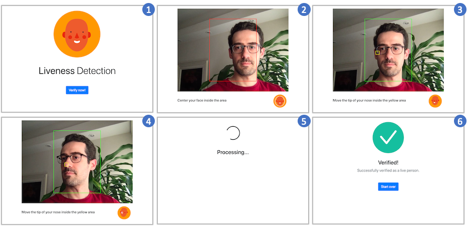
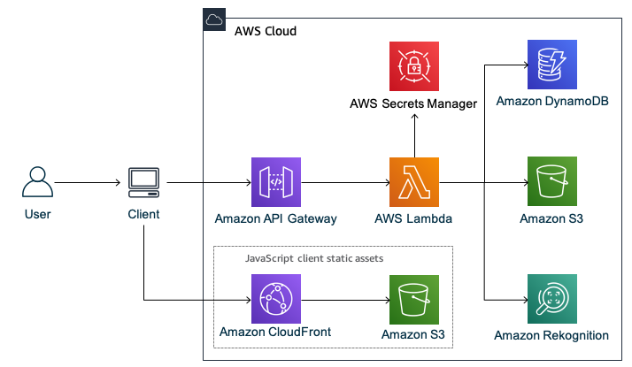

# Liveness Detection

This package includes the backend and a JavaScript frontend of a liveness detection application.

The application asks the user to perform a challenge: the user must move the nose to a random area shown on the screen. In the end, the following is verified: 1. there was one and only one face, 2. the user moved the nose to the target area, and 3. the user rotated the face.

Following there are some screenshots of a user performing the challenge:



Following is the architecture of the application:



## Setup

### Prerequisites

1. Configure the AWS Credentials in your environment. Refer to [Configuration and credential file settings](https://docs.aws.amazon.com/cli/latest/userguide/cli-configure-files.html).

2. Download and install AWS CLI. Refer to [Installing the AWS CLI](https://docs.aws.amazon.com/cli/latest/userguide/cli-chap-install.html).

3. Download and install AWS SAM CLI. Refer to [Installing the AWS SAM CLI](https://docs.aws.amazon.com/serverless-application-model/latest/developerguide/serverless-sam-cli-install.html).

4. Download and install Docker. Refer to [Docker](https://www.docker.com/products/docker-desktop).

5. Download and install Node.js. Refer to [Node.js Downloads](https://nodejs.org/en/download/).

### Backend

Run the command below to deploy the backend:

```
sam build --use-container && sam deploy --guided
```

The command above creates a CloudFormation stack with the following outputs: `ApiUrl`, `StaticWebsiteUrl`, and `StaticWebsiteBucket`. You need those values in the next steps.

### Frontend

1. Enter in the `client/` directory.

2. Download the ML models from [face-api.js library](https://github.com/justadudewhohacks/face-api.js):

 ```
 curl -o public/weights/tiny_face_detector_model-shard1.shard -kL https://github.com/justadudewhohacks/face-api.js/blob/master/weights/tiny_face_detector_model-shard1?raw=true

 curl -o public/weights/tiny_face_detector_model-weights_manifest.json -kL https://github.com/justadudewhohacks/face-api.js/blob/master/weights/tiny_face_detector_model-weights_manifest.json?raw=true

 curl -o public/weights/face_landmark_68_model-shard1.shard -kL https://github.com/justadudewhohacks/face-api.js/blob/master/weights/face_landmark_68_model-shard1?raw=true

 curl -o public/weights/face_landmark_68_model-weights_manifest.json -kL https://github.com/justadudewhohacks/face-api.js/blob/master/weights/face_landmark_68_model-weights_manifest.json?raw=true
```

3. Change the models' paths in the manifests:

 ```
 perl -i -pe 's/tiny_face_detector_model-shard1/tiny_face_detector_model-shard1.shard/g' public/weights/tiny_face_detector_model-weights_manifest.json

 perl -i -pe 's/face_landmark_68_model-shard1/face_landmark_68_model-shard1.shard/g' public/weights/face_landmark_68_model-weights_manifest.json
 ```

4. Open the `.env` file and replace the value of `VUE_APP_API_URL` with the API URL (`ApiUrl`) outputed during the bakend deployment.

5. Run the comamand below to build the frontend:

 ```
 npm install && npm run build
 ```

6. Copy the static frontend files with the following command (replace `{YOUR_BUCKET}` with the bucket name - `StaticWebsiteBucket` - outputed during the bakend deployment):

 ```
 aws s3 cp dist s3://{YOUR_BUCKET}/ --recursive
 ```

Open your browser and navigate to the CloudFront URL (`StaticWebsiteUrl`) outputed during the bakend deployment.

## Security

See [CONTRIBUTING](CONTRIBUTING.md#security-issue-notifications) for more information.

## License

This library is licensed under the MIT-0 License. See the LICENSE file.
